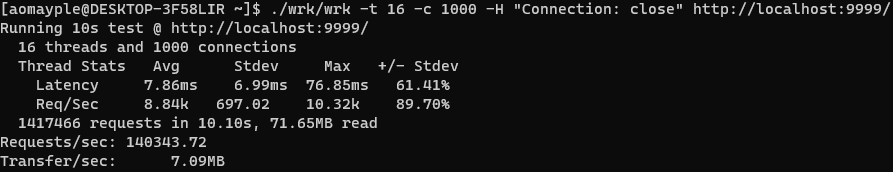
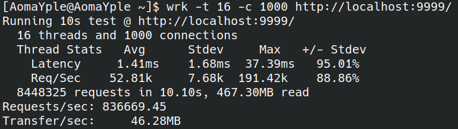

本项目是基于C++23的高并发Web服务器  
测试环境：Arch WSL 8核16GB  
[wrk](https://github.com/wg/wrk)是github上拥有34.2k star的项目  
wrk是一个现代的HTTP基准测试工具，在单个多核CPU上运行时能够产生巨大的负载。它将多线程设计与可扩展的事件通知系统（如epoll和kqueue）相结合。  
短连接并发能力测试  
  
QPS：140343.72  
长连接并发能力测试  
  
QPS：716039.89
