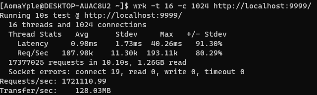

## 介绍

本项目是一个基于c++23和io_uring的异步高并发Proactor模式服务器，利用io_uring的特性实现真正的异步收发

## 性能测试

Arch WSL  
8核16线程，16G内存  
利用[wrk](https://github.com/wg/wrk)测试，测试结果如下  


RPS:178万（每秒处理的请求数量）

wrk是一款现代HTTP基准测试工具，在单核CPU上运行时能够产生巨大的负载。它将多线程设计与可扩展的事件通知系统（如epoll和kqueue）相结合

## 登录注册演示


## 并发模型

模型是one loop per thread，各线程间相互独立，互不干扰

## 事件循环

每个事件循环都持有一个io_uring实例，服务器实例，定时器实例和数据库连接,对产生的事件进行处理

## 异步日志

日志利用异步的无锁队列实现，前端只需往队列中添加日志，后端会自动将日志写入到log.log文件，真正实现异步写入且线程安全

## io_uring

使用RAII包装io_uring中的各个资源与函数，实现生命周期的良好管理

## 数据库

数据库使用mariadb，通过对mariadb c api的简单封装，实现了数据库的连接与断开，查询和插入，在运行前需要在mariadb中创建数据库和表，如下

```shell
create database webServer;

use webServer;

CREATE TABLE `users` (
  `id` bigint(20) unsigned NOT NULL AUTO_INCREMENT,
  `password` varchar(32) NOT NULL,
  PRIMARY KEY (`id`)
) ENGINE=InnoDB DEFAULT CHARSET=utf8mb4 COLLATE=utf8mb4_unicode_ci;
```

## 定时器

利用时间轮实现定时器，定时器的精度为1s，会自动处理超时的文件描述符

## 服务器与客户端

简单对文件描述符进行封装，实现了对文件描述符的读写，关闭等操作

## json解析

简单实现了json的解析，支持json的大部分语法

## http解析

支持长连接，支持http1.1，支持GET和HEAD和POST请求，支持静态资源请求，支持br压缩，利用mariadb支持登陆与注册，支持网页，图片和视频的请求

## 环境

gcc，liburing，cmake，ninja，brotli，mariadb

## 编译

```shell 
cmake -B build -G Ninja -DCMAKE_BUILD_TYPE=Release
cd build
ninja
```

## 运行

```shell
cd build/webServer
./webServer
```