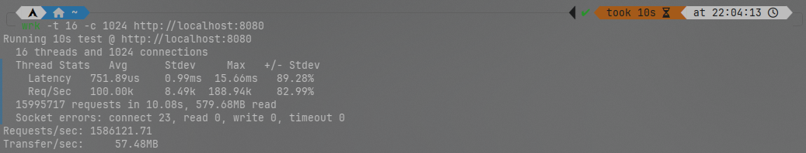

## 介绍

本项目是linux上一个基于c++23和io_uring的异步高并发Proactor模式服务器

## 协程

简单包装coroutine，实现了Awaiter和Task

## json

基于递归下降实现了对json的解析和生成

## 日志

前端只需push日志，后端会自动利用io_uring的特性异步写入日志文件，利用linux的O_APPEND特性，不会出现日志错乱的情况

## io_uring

简单包装了io_uring中的各种函数和资源

## 服务器与客户端

简单对文件描述符进行封装，实现了对文件描述符的收发，关闭等操作

## 定时器

基于层级时间轮实现定时器，定时器的精度为1s，会自动处理超时的文件描述符，可支持极大时间范围

## 数据库

数据库使用mariadb，通过对mariadb c api的简单封装，实现了数据库的连接与断开，查询和插入，在运行前需要在mariadb中创建数据库和表，如下

```sql'
create database webServer;

use webServer;

CREATE TABLE `users` (
`id` bigint(20) unsigned NOT NULL AUTO_INCREMENT,
`password` varchar(32) NOT NULL,
PRIMARY KEY (`id`)
) ENGINE=InnoDB DEFAULT CHARSET=utf8mb4 COLLATE=utf8mb4_unicode_ci;
```

## http

支持http1.1、长连接和br压缩，支持GET、HEAD和POST，支持请求网页、图片和视频，支持登录和注册

## 调度器

每个调度器都持有一个io_uring实例，日志实例，服务器实例，定时器实例和http解析器实例，调度器将会调度协程的挂起、恢复和销毁

## 并发模型

程序会根据cpu核心数创建相应数量的调度器，每个调度器互相独立，互不干扰

## 信号处理

程序会处理SIGTERM和SIGINT信号，优雅地关闭服务器

## 环境

gcc，cmake，ninja，liburing，brotli，mariadb

## 编译

```shell 
cmake -B build -G Ninja -DCMAKE_BUILD_TYPE=Release
cd build
ninja
```

## 运行

```shell
cd build/webServer
./webServer
```

## 性能测试

Arch WSL  
8核  
利用[wrk](https://github.com/wg/wrk)测试，测试结果如下  


RPS:170万（每秒处理的请求数量）

wrk是一款现代HTTP基准测试工具，在单核CPU上运行时能够产生巨大的负载。它将多线程设计与可扩展的事件通知系统（如epoll和kqueue）相结合

## 演示


