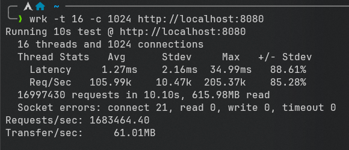

## 介绍

本项目是linux上一个基于c++23和io_uring的异步高并发Proactor模式服务器

## 协程

简单包装<coroutine>，实现了Awaiter和Generator

## json

基于递归下降实现了对json的解析和生成

## 日志

基于单例模式和无锁队列实现，前端只需往队列中添加日志，后端会自动将日志写入到log.log文件，并实现了一个简单的异常类

## io_uring

简单包装了liburing中的各种函数和资源

## 服务器与客户端

简单对文件描述符进行封装，实现了对文件描述符的读写，关闭等操作

## 定时器

基于时间轮实现定时器，定时器的精度为1s，会自动处理超时的文件描述符

## http

支持http1.1、长连接和br压缩，支持GET和HEAD和POST，支持静态资源请求，支持请求网页，图片、视频，支持登录和注册

## 调度器

每个调度器都持有一个io_uring实例，服务器实例，定时器实例和数据库连接，调度器将会调度协程的挂起、恢复和销毁

## 并发模型

程序会根据cpu核心数创建相应数量的调度器，每个调度器互相独立，不会相互影响，互不干扰

## 环境

kernel 6.1以上，gcc13以上，liburing，cmake，ninja，brotli，mariadb

## 编译

```shell 
cmake -B build -G Ninja -DCMAKE_BUILD_TYPE=Release
cd build
ninja
```

## 运行

```shell
cd build/webServer
./webServer
```

## 性能测试

Arch WSL  
8核  
利用[wrk](https://github.com/wg/wrk)测试，测试结果如下  


RPS:172万（每秒处理的请求数量）

wrk是一款现代HTTP基准测试工具，在单核CPU上运行时能够产生巨大的负载。它将多线程设计与可扩展的事件通知系统（如epoll和kqueue）相结合

## 演示


