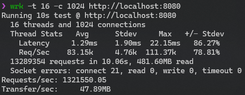
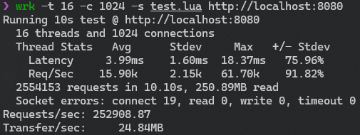

## 介绍

本项目是Linux上一个基于C++和io_uring的异步高并发Proactor模式服务器

## io_uring

利用io_uring实现了高性能的异步IO，支持多个IO操作的批量提交，减少系统调用次数，提高性能

## 日志

利用io_uring的异步io和Linux O_APPEND特性实现了异步且线程安全的高性能日志系统，支持多种日志级别和提供详细的日志信息

## JSON

基于递归下降实现了对JSON的解析和生成，支持近乎所有的JSON格式，用于支持HTTP请求和响应的解析和生成

## 协程

封装C++20协程的coroutine，实现了Awaiter和Task，简化异步编程

## 定时器

基于层级时间轮实现定时器，定时器的精度为1s，支持极大时间范围，会自动处理超时的连接，节省服务器资源

## HTTP

支持HTTP1.1、长连接和br压缩，支持GET、HEAD和POST请求，支持请求网页、图片和视频，支持登录和注册

## 数据库

数据库使用MariaDB（MySQL的开源实现）存储用户的信息，使用前需要创建数据库和表，如下：

```sql'
create database webServer;

use webServer;

CREATE TABLE `users` (
`id` bigint(20) unsigned NOT NULL AUTO_INCREMENT,
`password` varchar(32) NOT NULL,
PRIMARY KEY (`id`)
) ENGINE=InnoDB DEFAULT CHARSET=utf8mb4 COLLATE=utf8mb4_unicode_ci;
```

## 调度器

基于协程实现了一个简单的调度器，支持协程的创建、销毁、挂起和唤醒，程序会根据CPU核心数创建相应数量的调度器，每个调度器互相独立，互不干扰

## 信号处理

自动处理SIGTERM和SIGINT信号，释放所有资源后优雅地关闭服务器

## 环境

GCC14及以上，CMake，Ninja，liburing2.7及以上，Brotli，MariaDB

## 编译

```shell 
cmake -B build -G Ninja -DCMAKE_BUILD_TYPE=Release
cd build
ninja
```

## 运行

```shell
cd build/webServer
./webServer
```

## 性能测试

Arch WSL  
8核  
利用[wrk](https://github.com/wg/wrk)测试

RPS:132万（每秒处理的http请求数量）  


RPS:25万（每秒处理的数据库查询数量）  


wrk是一款现代HTTP基准测试工具，在单核CPU上运行时能够产生巨大的负载。它将多线程设计与可扩展的事件通知系统（如epoll和kqueue）相结合

## 演示


